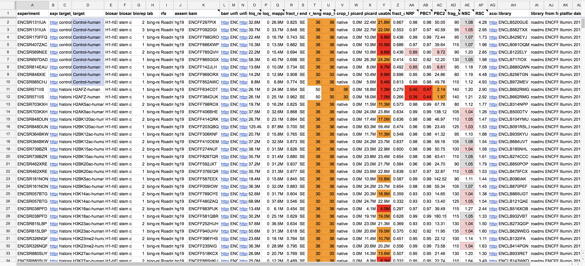

# ENCODE general QC report

[](https://travis-ci.org/ENCODE-DCC/WranglerScripts)

The general QC reporting tool pulls experiment, file, and quality metric metadata from the ENCODE portal and builds reproducibly formatted reports in Google Sheets.


*Example transcription factor (TF) mapping report*

It is easily extensible to new assay types, formatting rules, and metadata fields. The currently supported report types:

* rna_mapping (i.e. mapping metrics in RNA experiments)
* rna_qc (i.e. gene quantifications metrics in RNA experiments)
* histone_qc
* histone_mapping
* tf_mapping
* tf_qc

### How to use 

1. Install dependencies (*must use Python 2*):
```bash
pip install -r requirements.txt
```

2. Ask for ENCODE account credentials and client_secret file (client_secret_xxxx.json) allowing scripts to use Google API.

3. Authorize scripts to access Google Drive/Sheets for particular account:

```python
import pygsheets

gc = pygsheets.authorize(outh_file='client_secret_xxxx.json')

# Follow OAuth procedure.
```

Drop resulting sheets.googleapis.com-python.json in home folder (or specify path with --apikey argument).

4. Run reporting tool example command:

```bash
$ python general_qc_report.py --key prod --assembly GRCh38 --report_type rna_mapping --sheet_title ENCODE_QC -o google_sheets -s
```

Options:

| command  | description |
| ------------- | ------------- |
| `-h, --help` | Show help message  |
| `-d, --debug`  | Print debug messages  |
| `--key KEY` | The keypair identifier from the keyfile  |
| `--keyfile KEYFILE`  | The keyfile  |
| `--assembly` `{GRCh38, hg19 , mm10}` | Genome assembly  |
| `-r, --report_type` `{histone_qc, histone_mapping, tf_mapping, tf_qc, rna_mapping, rna_qc}`  | Report type  |
| `--sheet_title SHEET_TITLE` | Name of Google Sheet  |
| `--api_key API_KEY`  | Path to secret credential for Google Sheets  |
| `-o, --output_type` `{tsv,google_sheets}`  | Output to TSV or Google Sheets (requires authentication)  |
| `-s, --skip_dnanexus` | Skip requests from DNAnexus (much faster) |

5. Examine results posted to Google Sheets.

6. Run tests using pytest (for development):

```bash
$ pytest -k 'test_general'
$ pytest -k 'test_functional'
$ pytest -k 'test_output'
```
